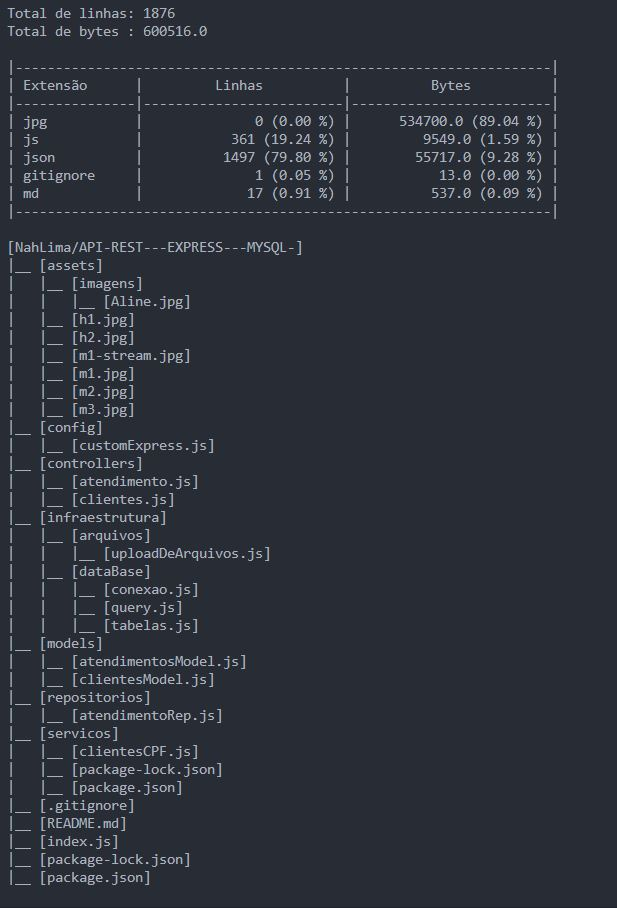

# GitPy-repositórios
#desafio

------------------------

O Export do arquivo  com a informação referente ao repositório fica salvo como **exportRepository.txt** 

Há um arquivo já exportado como exemplo de como ficaria. No caso, alterei o nome deste exemplo para não gerar conflito. O nome do arquivo é **exportRepositoryVivaDecora.txt** 

Ao iniciar a aplicação, será possível ler no console: 
````
Hello World
analisando os dados...
Pode demorar um pouco...
Gerando arquivo txt
````

# Ferramentas
- python 
- visual studio code
- ambiente virtual (venv)  
- conda

# 1. Ambiente virtual
Usei o ambiente virtual dentro do Visual Studio Code (windows). Para isso, digite o comando na pasta do projeto:

````javascript
python -m venv " + o nome do ambiente"

/* na sequência precisamos ativar o ambiente digite o código */

.\"nome do ambiente"\Scripts\Activate.ps1 

/* usamos ps1 porque estamos no powershell 
 se der um erro no seu powershell, é porque ele é restrito por 
padrão, então vamos precisar destrava-lo */

````

No windowsPowerShell (admin), digite o comando :
````javascript
Set-ExecutionPolicy -Scope CurrentUser -ExecutionPolicy RemoteSigned 
````
Depois digite 
````javascript
S 
// para confirmar
````

Vá até o terminal do Visual Studio Code e ative o ambiente com o comando citado acima. 


# 2. Instalando as dependências
Após estar no seu ambiente, vamos instalar as dependências que estão no arquivo **requirements.txt**.
No terminal, na raiz do projeto, digite o comando:

````javascript
pip install -r requirements.txt
````
# 3. Testando a aplicação

````javascript
python execute.py  

// ou dar o comando CTRL+ ALT + N no arquivo execute.py
````

----------------------------------------------------------------------------

# Pontos a melhorar

- Fazer com que o código busque uma lista de repositórios e exporte cada resultado  individualmente. 

- Melhorar a performance 

- Exportar de forma mais inteligente os arquivos txt


# Observação

Para testar com outros repositórios, basta mudar o endereço que está no 
código **execute.py**

````javascript
//exemplo 
    tree = process_url('NahLima/API-REST---EXPRESS---MYSQL-')  // aqui 
    generate_report('NahLima/API-REST---EXPRESS---MYSQL-', tree) // e aqui
````
Para retornar no console, é só deixar comentadas as linhas 6 e 14 do arquivo **execute.py**

```` javascripit
//deixar comentadas essas duas linhas

sys.stdout = open("exportRepository.txt", "w") 
sys.stdout.close()

````

